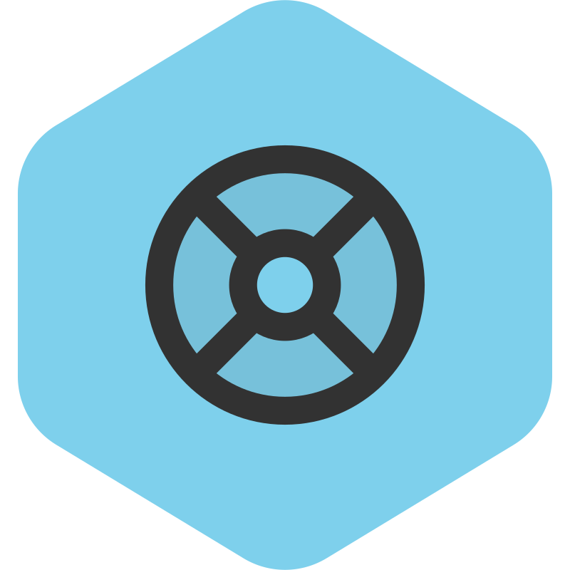

# 👋 Welcome to Velocity Report

<!-- Data Statistics / 数据统计 -->

### [VelocityReport] aims to be the best report plugin out there.

### The plugin supports [Velocity]/[Spigot]/[Paper]/[Purpur].

<table>
<thead>
<tr>
<th width="2000" colspan="2">
</th>
<h2>🧭 Links</h2>
</tr>
</thead>
<tbody>
<tr>
  <td width="80" align="center" valign="top">
     
    
  </td>
  <td valign="top">
    <h3>Wiki</h3>
    

      Don't know how to use it? <a href="https://github.com/Syrent/VelocityReport/wiki">Click here to start getting started</a>!
       
      <a href="https://github.com/Syrent/VelocityReport/wiki/Why-VelocityReport">And why Velocity Reoprt</a>?
    

  </td>
</tr>
  <td width="80" align="center" valign="top">
     
    
  </td>
  <td>
    <h3>Support</h3>
    

      Join our <a href="https://discord.gg/VZk2XU3kFg">discord community</a> for more help.
    

  </td>
</tr>
<tr>
  <td width="80" align="center" valign="top">
     
    
  </td>
  <td>
    <h3>Report Bugs</h3>
    

      Experiencing bugs when using the plugin? <a href="https://github.com/Syrent/VelocityReport/issues">Click here to feedback bugs</a>.
    

  </td>
</tr>
</tbody>
</table>

<table>
<thead>
<tr>
<th width="2000" colspan="2">
</th>
<h2>🚀 Plugin Release Page</h2>
</tr>
</thead>
<tbody>
<tr>
  <td width="80" align="center" valign="top">
     
    
  </td>
  <td valign="top">
    <h3>Github Releases</h3>
    

      <a href="https://github.com/Syrent/VelocityReport/releases">Click to go to Github releases page</a>.
    

  </td>
</tr>
<tr>
  <td width="80" align="center" valign="top">
     
    
  </td>
  <td valign="top">
    <h3>Modrinth</h3>
    

      <a href="https://modrinth.com/plugin/velocityreport">Click to go to Modrinth plugin release page</a>.
    

  </td>
</tr>
<tr>
  <td width="80" align="center" valign="top">
     
    
  </td>
  <td valign="top">
    <h3>SpigotMC</h3>
    

      <a href="https://www.spigotmc.org/resources/105378">Click to go to SpigotMC plugin release page</a>.
    

  </td>
</tr>
<tr>
  <td width="80" align="center" valign="top">
     
    
  </td>
  <td valign="top">
    <h3>PaperMC</h3>
    

      <a href="https://forums.papermc.io/threads/515">Click to go to PaperMC plugin release page</a>.
    

  </td>
</tr>
</tbody>
</table>

# 🛠 Compiling
⚠ Compilation requires JDK 8 and up.

To compile the plugin, run `./gradlew build` from the terminal.   
Once the plugin compiles, grab the jar from `/bin` folder.      

# 🍪 Contributing
If this plugin has helped you in any way, and you would like to return something back to make the plugin even better, there is a lot of ways to contribute:

* Open a **pull request** containing a new feature or a bug fix, which you believe many users will benefit from.
Make detailed high-quality bug reports. The difference between a bug getting fixed in 1 week vs 1 hour is in quality of the report (typically providing correct steps to reproduce that actually work).
* Help improve the wiki by opening a Wiki change issue, where you can improve existing descriptions, add information you found missing, fix typos / grammar mistakes or add more examples of usage of functions.

## 🌐 Language switch

语言切换 / Need to switch languages?

2023 © [Syrent](https://github.com/Syrent)

<!-- URL LIST -->
[Spigot]: https://www.spigotmc.org
[Paper]: https://papermc.io
[Purpur]: https://purpurmc.org
[Velocity]: https://velocitypowered.com
[VelocityReport]: https://github.com/Syrent/VelocityReport

<!-- Rev1.0 Designed by chencu5958 -->
<!-- SVG icons from svgrepo.com -->
